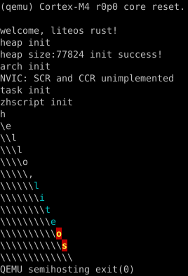

+ 式微，式微！胡不归？
+ 不行了，不行了，你怎么还在写程序？

这是 zhscript （中文脚本）锈版的 no-std 版。

按照“无数据、不牵强”的主题思想来写，写在一个文件里以为凝练，练码不辍、户枢不蠹乃作者按

### hello, world 之 liteos

在 liteos-rs 项目里建立如 zhscript 目录，

内建 Cargo.toml 如
```toml
[package]
name = "zhscript"
version = "0.1.0"
edition = "2021"

[dependencies]
cortex-m-semihosting = "0.3.3"
#zhscript2-no-std = { git = "https://gitee.com/zzzzzzzzzzz4/zhscript2-no-std-rust" }
zhscript2-no-std = { git = "https://github.com/zzzzzzzzzzz0/zhscript2-no-std-rust" }
```

再建 src/lib.rs 如
```rust
#![no_std]
use zhscript2_no_std::{world_, pr__};

pub fn init() {
	pr__!("zhscript init\n");
	world_::hello__(r"
		显示
		循环【第】先
			循环【‘第’】【次】
				分叉‘次’先
					‘第’分叉‘第’先
						循环【6】【4】【序】先‘序’、了先ESC[0;36m了。
						11、12 先ESC[1;33;41m了。
						1“h”。
						2、10“e”。
						3、4、7“l”。
						5、11“o”。
						6“,”。
						8“i”。
						9“t”。
						12“s”。
						循环【6】【6】【序】先‘序’、了先ESC[m了。
						13 先
							\。
							跳出第。
						了
					了。
					\。
				了。
			换行
		了。");
}
```

后诸如

/Cargo.toml
```toml
[workspace]
members = [
...
    "zhscript",
]
...
```

/boards/stm32f4xx/Cargo.toml
```toml
...
[dependencies]
...
zhscript = {path = "../../zhscript"}
```

/boards/stm32f4xx/src/main.rs
```rust
...
fn main() -> ! {
...
	zhscript::init();
...
```

便“cargo r --bin stm32f4xx”可得



